# System Architecture Overview

This document provides a comprehensive overview of the NestJS Template API architecture, design decisions, and system components.

## Table of Contents

- [Architecture Style](#architecture-style)
- [Technology Stack](#technology-stack)
- [System Components](#system-components)
- [Module Architecture](#module-architecture)
- [Data Flow](#data-flow)
- [Configuration Management](#configuration-management)
- [Error Handling Strategy](#error-handling-strategy)
- [Logging Architecture](#logging-architecture)
- [Security Architecture](#security-architecture)
- [Performance Considerations](#performance-considerations)

## Architecture Style

### Modular Monolith

The application follows a **modular monolith** architecture pattern:

- **Single Deployable Unit**: All components are packaged and deployed together
- **Module Boundaries**: Clear separation of concerns through NestJS modules
- **Shared Infrastructure**: Common utilities, configuration, and middleware
- **Scalability**: Can be refactored to microservices if needed

### Benefits

- **Simplicity**: Single codebase, deployment, and runtime
- **Performance**: No network overhead between modules
- **Development Speed**: Faster development and testing cycles
- **Consistency**: Shared patterns and utilities across modules

### Trade-offs

- **Scaling**: All modules scale together
- **Technology Diversity**: Single technology stack
- **Team Independence**: Shared codebase requires coordination

## Technology Stack

### Core Framework

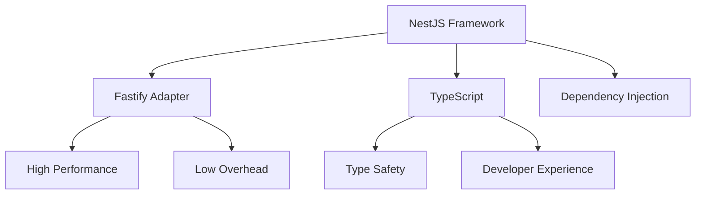

### Dependencies

| Category | Technology | Purpose |
|----------|------------|---------|
| **Framework** | NestJS 11.x | Application framework with decorators and DI |
| **HTTP Server** | Fastify 4.x | High-performance HTTP server |
| **Language** | TypeScript 5.x | Type-safe JavaScript with strict mode |
| **Logging** | Pino 10.x | High-performance structured logging |
| **Validation** | Zod 4.x | Schema validation and type inference |
| **Documentation** | Swagger/OpenAPI | API documentation and specs |
| **Security** | Helmet | Security headers and middleware |
| **Testing** | Jest 30.x | Unit and integration testing |
| **Property Testing** | fast-check 4.x | Property-based testing |
| **Database** | DatabaseModule | Raw PostgreSQL query infrastructure |
| **MCP Integration** | @modelcontextprotocol/sdk 1.x | AI agent connectivity with multiple transports |

## System Components

### High-Level Architecture

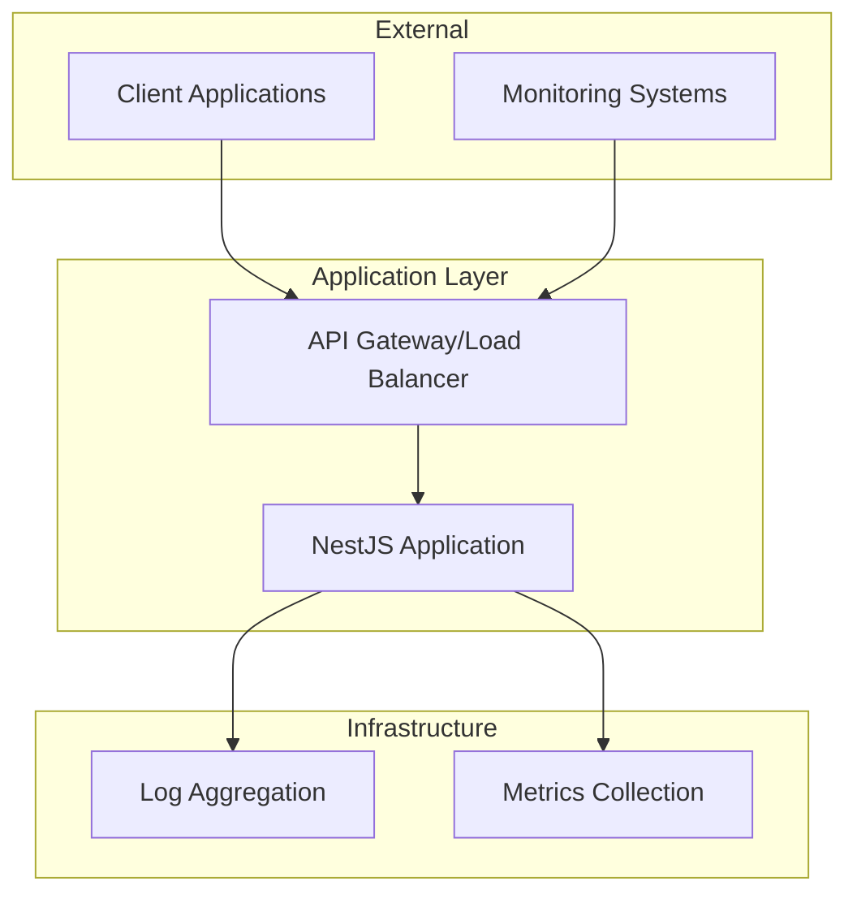

### Application Structure

```
src/
├── main.ts                 # Application bootstrap and configuration
├── app.module.ts          # Root module with global imports
├── config/                # Configuration management
│   ├── app.config.ts      # Application settings with Zod validation
│   ├── log.config.ts      # Logging configuration with Zod validation
│   ├── mcp.config.ts      # MCP server configuration with Zod validation
│   └── routes.config.ts   # API routes configuration
├── common/                # Shared utilities and infrastructure
│   ├── decorators/        # Custom parameter decorators
│   ├── exceptions/        # Custom exception classes
│   ├── filters/           # Global exception filters
│   ├── interceptors/      # Request/response interceptors
│   ├── services/          # Shared services (ContextLoggerService)
│   └── utils/             # Utility functions and helpers
├── infrastructure/        # Infrastructure layer
│   ├── database/          # Database service and configuration
│   └── mcp/               # MCP server implementation
│       ├── transports/    # HTTP, SSE, STDIO transport implementations
│       ├── mcp.module.ts  # MCP module configuration
│       └── mcp-server.service.ts  # MCP server service
└── modules/               # Feature modules
    ├── health/            # Health check functionality with MCP tools
    │   ├── dto/           # Health response DTOs
    │   ├── mcp/           # Health-specific MCP tools and resources
    │   ├── health.controller.ts
    │   ├── health.service.ts
    │   └── health.module.ts
    └── template/          # Template API module (to be renamed in new projects)
        ├── template.controller.ts
        ├── template.service.ts
        ├── template.module.ts
        ├── entities/      # Empty - ready for your entities
        └── repositories/  # Empty - ready for your repositories
```

## Module Architecture

### NestJS Module Pattern

Each feature module follows a consistent structure:

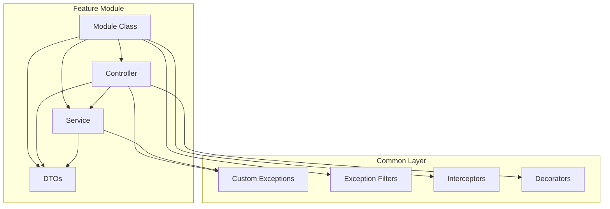

### Module Responsibilities

| Component | Responsibility |
|-----------|----------------|
| **Controller** | HTTP request handling, validation, response formatting |
| **Service** | Business logic, data processing, external integrations |
| **Module** | Dependency injection configuration, exports |
| **DTOs** | Data transfer objects with validation schemas |

### Dependency Flow

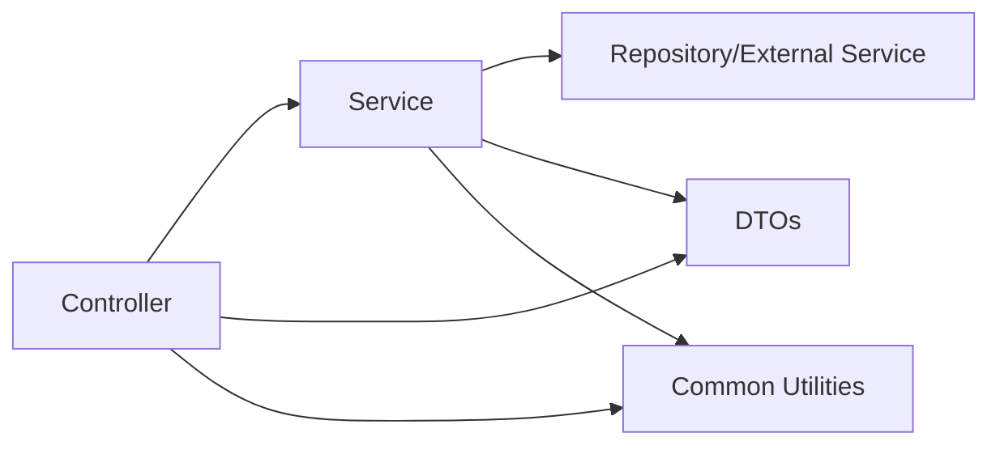

## Data Flow

### Request Processing Pipeline

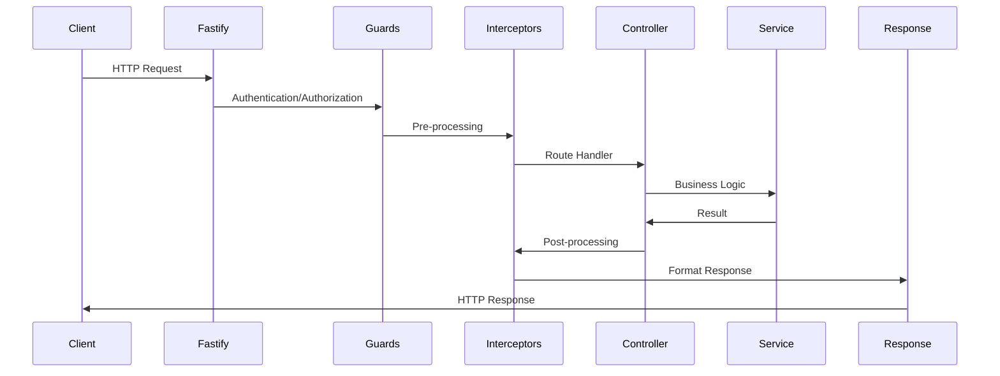

### Error Handling Flow

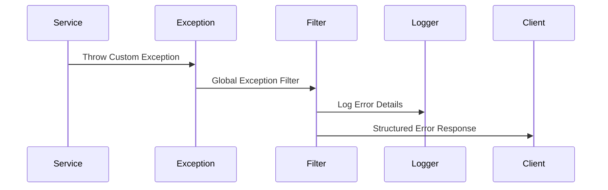

## Configuration Management

### Configuration Architecture

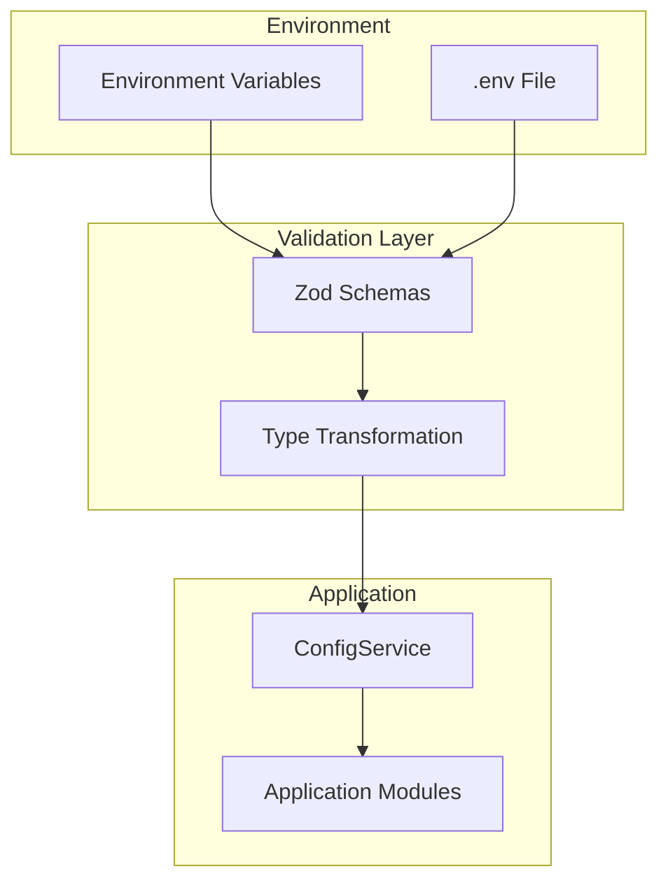

### Configuration Features

- **Type Safety**: Zod schemas generate TypeScript types
- **Validation**: Runtime validation with clear error messages
- **Defaults**: Sensible default values for all settings
- **Environment Specific**: Different configs for dev/staging/production
- **Hot Reload**: Configuration changes trigger application restart

### Configuration Categories

| Category | File | Purpose |
|----------|------|---------|
| **Application** | `app.config.ts` | Server, API, security settings |
| **Logging** | `log.config.ts` | Log levels, formatting, transports |

## Error Handling Strategy

### Exception Hierarchy

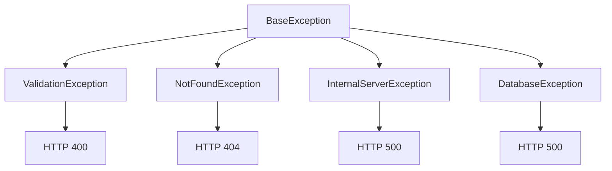

### Error Processing Flow

1. **Exception Thrown**: Custom or framework exception
2. **Global Filter**: Catches all exceptions
3. **Error Formatting**: Structured error response
4. **Logging**: Error details with correlation ID
5. **Response**: Client receives formatted error

### Error Response Structure

```typescript
interface ErrorResponse {
  id: string;           // Unique error identifier
  instance: string;     // Request path
  status: number;       // HTTP status code
  type: string;         // Error classification
  errcode: string;      // Application error code
  message: string;      // User-friendly message
  detail?: ErrorDetail; // Optional detailed information
}
```

## Logging Architecture

### Structured Logging with Pino

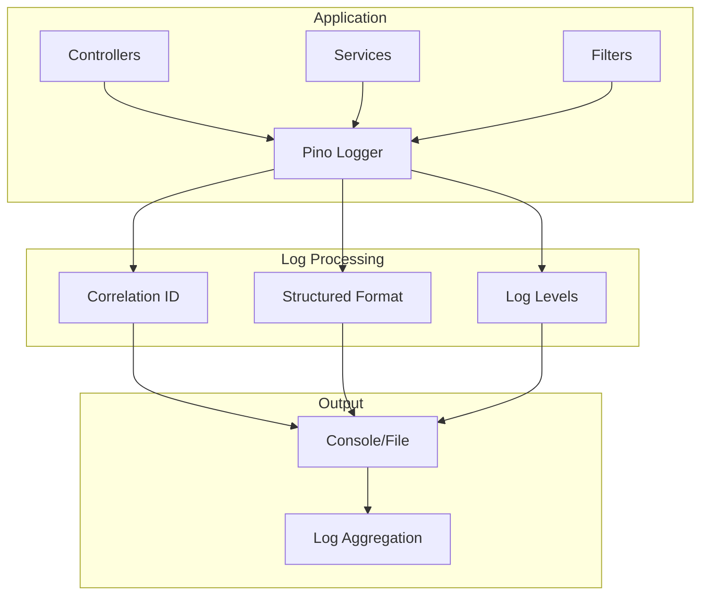

### Logging Features

- **Correlation IDs**: Track requests across the application
- **Structured Format**: JSON format for machine processing
- **Performance**: High-performance logging with minimal overhead
- **Levels**: Configurable log levels (trace, debug, info, warn, error, alert)
- **Context**: Automatic context injection (request ID, user ID)

### Log Levels Usage

| Level | Usage | Examples |
|-------|-------|----------|
| **trace** | Response completion | Request processing complete |
| **debug** | Detailed debugging | Variable values, flow control |
| **info** | General information | Request start, important events |
| **warn** | Non-blocking issues | Deprecated API usage, fallbacks |
| **error** | Exceptions | Caught exceptions, error conditions |
| **alert** | Critical issues | System failures, security alerts |

## Security Architecture

### Security Layers

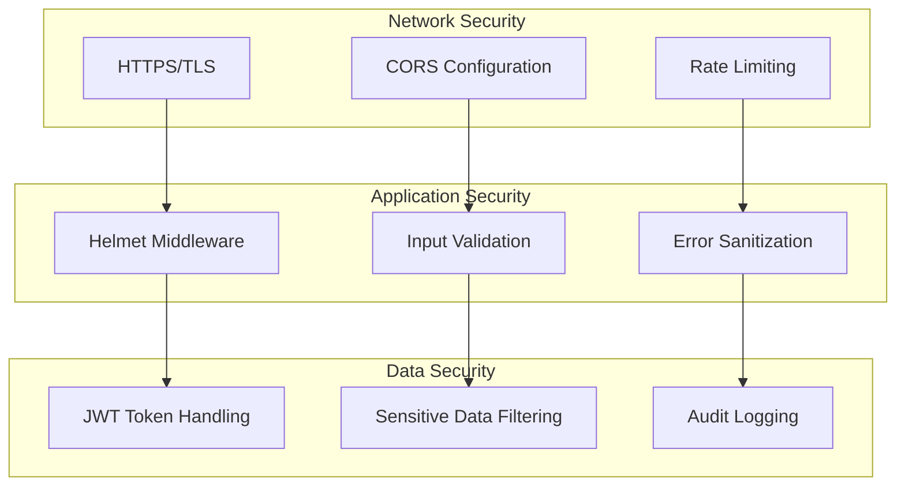

### Security Features

- **Helmet Integration**: Security headers (CSP, HSTS, X-Frame-Options)
- **CORS Configuration**: Configurable cross-origin resource sharing
- **Input Validation**: Zod schema validation for all inputs
- **Error Sanitization**: Configurable error detail exposure
- **JWT Support**: Token extraction without validation (handled by gateway)
- **Audit Trail**: Comprehensive request/response logging

## Performance Considerations

### Performance Optimizations

| Area | Optimization | Benefit |
|------|-------------|---------|
| **HTTP Server** | Fastify adapter | 2x faster than Express |
| **Logging** | Pino logger | 5x faster than Winston |
| **Validation** | Zod schemas | Compile-time optimization |
| **Serialization** | Native JSON | Faster than class-transformer |
| **Memory** | Minimal dependencies | Reduced memory footprint |

### Scalability Patterns

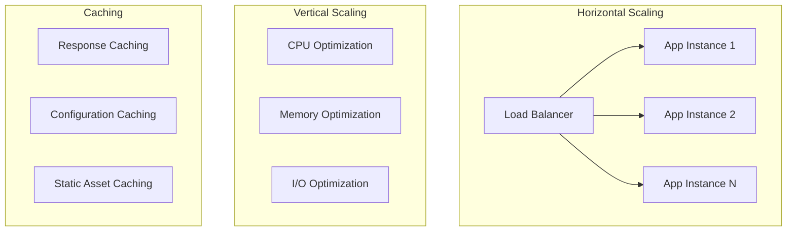

### Performance Monitoring

- **Response Times**: Tracked via correlation IDs
- **Memory Usage**: Node.js process monitoring
- **CPU Usage**: Application performance metrics
- **Error Rates**: Exception tracking and alerting
- **Throughput**: Requests per second monitoring

## Deployment Architecture

### Container Strategy

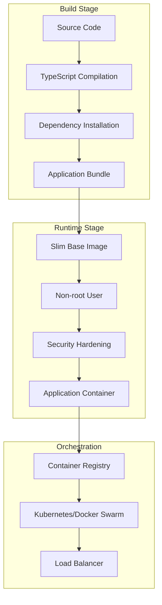

### Deployment Features

- **Multi-stage Builds**: Optimized container size
- **Security**: Non-root user, minimal attack surface
- **Health Checks**: Built-in health monitoring
- **Graceful Shutdown**: Proper cleanup on termination
- **Environment Configuration**: Externalized configuration

## Monitoring and Observability

### Observability Stack

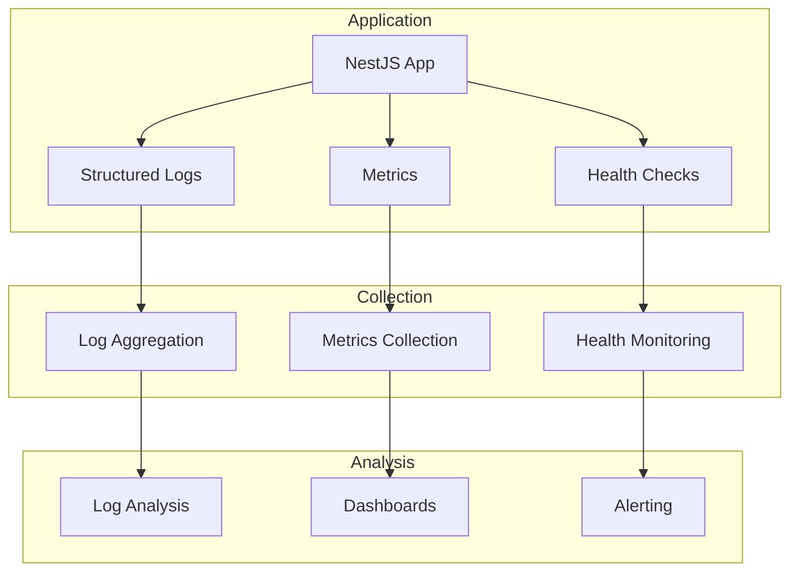

### Monitoring Capabilities

- **Health Endpoints**: Application health and readiness
- **Structured Logging**: Machine-readable log format
- **Correlation Tracing**: Request tracking across services
- **Error Tracking**: Exception monitoring and alerting
- **Performance Metrics**: Response times and throughput

## Future Considerations

### Potential Enhancements

1. **Database Integration**: Add TypeORM or Prisma for data persistence
2. **Caching Layer**: Redis integration for performance optimization
3. **Message Queues**: Event-driven architecture with RabbitMQ/Kafka
4. **Microservices**: Split modules into independent services
5. **API Versioning**: Support multiple API versions
6. **Rate Limiting**: Application-level rate limiting
7. **Circuit Breakers**: Resilience patterns for external dependencies

### Migration Paths

- **Database Addition**: Gradual introduction of persistence layer
- **Microservices Split**: Module-by-module extraction
- **Event Sourcing**: Transition to event-driven architecture
- **GraphQL**: Alternative API paradigm support

## Conclusion

The NestJS Template API architecture provides a solid foundation for building scalable, maintainable REST APIs. The modular monolith approach offers simplicity while maintaining flexibility for future growth. The comprehensive error handling, logging, and security features ensure production readiness.

Key architectural strengths:

- **Type Safety**: Full TypeScript integration with runtime validation
- **Performance**: Optimized technology stack (Fastify, Pino, Zod)
- **Maintainability**: Clear module boundaries and consistent patterns
- **Observability**: Comprehensive logging and monitoring capabilities
- **Security**: Multiple security layers and best practices
- **Testability**: Comprehensive testing strategy with property-based testing
- **Template Structure**: Ready-to-customize placeholder modules for rapid development

This template architecture supports rapid API development while maintaining production-grade quality standards. The template module provides a starting point that can be quickly customized for specific business requirements while preserving all infrastructure and quality features.
